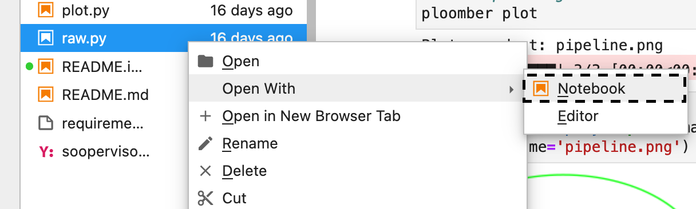

---
jupyter:
  jupytext:
    text_representation:
      extension: .md
      format_name: markdown
      format_version: '1.3'
      jupytext_version: 1.13.3
  kernelspec:
    display_name: Python 3 (ipykernel)
    language: python
    name: python3
---

# Taller de Ploomber

## 1. Introducción

Los cuadernos de Jupyter son un excelente entorno para la exploración de datos: nos permiten escribir código de forma interactiva y obtener retroalimentación visual, proporcionando una experiencia inmejorable para la comprensión de nuestros datos.

Sin embargo, esta conveniencia tiene un costo: si no tenemos cuidado al agregar y eliminar celdas de código, es posible que tengamos un cuaderno irreproducible. La orden de ejecución arbitraria es un problema frecuente: un [análisis reciente](https://blog.jetbrains.com/datalore/2020/12/17/we-downloaded-10-000-000-jupyter-notebooks-from-github-this-is-what-we-learned/) descubrió que alrededor del 36% de los cuadernos en GitHub no se ejecutaban en orden lineal. Para garantizar que nuestros proyectos funcionen, debemos probarlos continuamente para detectar estos problemas.

Un segundo problema notable es el tamaño de los cuadernos: cuantas más celdas tenemos, más difícil es depurarlo ya que hay más variables y código involucrado.

Los ingenieros de software suelen dividir los proyectos en varios pasos y realizar pruebas de forma continua para evitar que el código se rompa y no se pueda mantener. Sin embargo, aplicar estas ideas para el análisis de datos requiere un trabajo adicional: varios cuadernos implican que tenemos que asegurarnos de que la salida de una etapa se convierta en la entrada de la siguiente. Además, ya no podemos presionar "Ejecutar todas las celdas" en Jupyter para probar nuestro análisis de principio a fin.

**Ploomber proporciona todas las herramientas necesarias para construir pipelines reproducibles de múltiples etapas en Jupyter que se sienten como un solo cuaderno.** Los usuarios pueden dividir fácilmente su análisis en varios cuadernos y ejecutarlos todos con un solo comando.

## 2. Refactorización de un cuaderno existente

Si ya tiene un proyecto en un solo cuaderno, puede usar nuestra herramienta [Soorgeon](https://github.com/ploomber/soorgeon) para refactorizarlo automáticamente en un [Ploomber](https://github.com/ploomber/ploomber) pipeline.

Usemos el cuaderno de ejemplo localizado en el directorio `playground/`:

```sh
ls playground
```

Nuestro cuaderno de ejemplo es el archivo [`nb.ipynb`](playground/nb.ipynb), veamos su contenido.

Para refactorizar el cuaderno, usamos el comando `soorgeon refactor`:

```sh
cd playground
soorgeon refactor nb.ipynb
```

Veamos los contenidos del directorio:

```sh
ls playground
```

Podemos ver que tenemos algunos archivos nuevos. `pipeline.yaml` contiene la declaración del pipeline de datos, y `tasks/` contiene las *etapas* que Soorgeon identificó en base a nuestros encabezados H2 Markdown.

```sh
ls playground/tasks
```

Generamos ahora una gráfica del pipeline (tenga en cuenta que ahora estamos usando `ploomber`):

```sh
cd playground
ploomber plot
```

```python
from IPython.display import Image
Image('playground/pipeline.png')
```


Soorgeon identificó correctamente las *etapas* en nuestro cuaderno original `nb.ipynb`. Incluso detectó que las dos últimas tareas (`linear-regression`, and `random-forest-regressor` son independientes la una de la otra).

También podemos obtener un resumen del pipeline con `ploomber status`:

```sh
cd playground
ploomber status
```

<!-- #region -->
## 3. El archivo `pipeline.yaml`

Para desarrollar un pipeline, los usuarios crean un archivo `pipeline.yaml` y declaran las tareas y sus resultados de la siguiente manera:

```yaml
tasks:
  - source: script.py
    product:
      nb: output/executed.ipynb
      data: output/data.csv
  
  # more tasks here...
```

El pipeline anterior tiene una sola tarea (`script.py`) y genera dos salidas: `output/executed.ipynb` y `output/data.csv`. Quizás se pregunte por qué tenemos un cuaderno como salida: Ploomber convierte scripts en cuadernos antes de la ejecución; por lo tanto, nuestro script se considera la fuente y el cuaderno un subproducto de la ejecución. El uso de scripts como fuentes (en lugar de cuadernos) simplifica el uso de git. Sin embargo, esto no significa que deba renunciar al desarrollo interactivo, ya que Ploomber se integra con Jupyter, lo que le permite editar scripts como cuadernos.

En este caso, dado que usamos `soorgeon` para refactorizar un cuaderno existente, no tuvimos que escribir el archivo `pipeline.yaml`, echemos un vistazo al que se generó automáticamente: [`playground/pipeline.yaml`](playground/pipeline.yaml).

<!-- #endregion -->

## 4. Ejecutando el pipeline

Construyamos la canalización (esto tomará ~ 30 segundos):

```sh
cd playground
ploomber build
```

Vaya a `playground/output/` y verá todos los resultados: los cuadernos ejecutados, los archivos de datos y el modelo entrenado.

```sh
ls playground/output
```

## 5. Declarando dependencies

Veamos de nuevo nuestro diagrama del pipeline:

```python
Image('playground/pipeline.png')
```

<!-- #region -->

Las flechas en el diagrama representan dependencias de entrada/salida, por lo tanto, determinan el orden de ejecución. Por ejemplo, la primera tarea (`load`) carga algunos datos, luego` clean` usa esos datos como entrada y los procesa, luego `train-test-split` divide nuestro conjunto de datos en entrenamiento y prueba, finalmente, usamos esos conjuntos de datos para entrenar una regresión lineal y un *random forest regresor*.

Soorgeon extrajo y declaró estas dependencias por nosotros, pero si queremos modificar un pipeline existente, necesitamos declarar tales dependencias. Veamos como.

## 6. Agregando una nueva tarea

Digamos que queremos probar un nuevo model y decidimos agregar un [Gradient Boosting Regressor](https://scikit-learn.org/stable/modules/generated/sklearn.ensemble.GradientBoostingRegressor.html#sklearn.ensemble.GradientBoostingRegressor). Primero, modificamos el archivo `pipeline.yaml` y agregamos una nueva tarea.

#### Abre `playground/pipeline.yaml` y agrega las siguientes líneas al final

```yaml
- source: tasks/gradient-boosting-regressor.py
  product:
    nb: output/gradient-boosting-regressor.ipynb
```

Ahora, creemos un archivo base usando el comando `ploomber scaffold`:
<!-- #endregion -->

```sh
cd playground
ploomber scaffold
```

Veamos el diagrama actualizado:

```sh
cd playground
ploomber plot
```

```python
from IPython.display import Image
Image('playground/pipeline.png')
```

Puede ver que Ploomber reconoce el nuevo archivo, pero no tiene ninguna dependencia, así que digamos a Ploomber que debe ejecutarse después de `train-test-split`:

<!-- #region -->
####  Abre `playground/tasks/gradient-boosting-regressor.py` como un cuaderno dando click derecho en el archivo y después `Open With` -> `Notebook`:



En la parte superior del cuaderno, verá lo siguiente:

```python
upstream = None
```

Esta variable especial indica qué tareas deben ejecutarse antes que el cuaderno en el que estamos trabajando actualmente. En este caso, queremos obtener los datos de entrenamiento, pues los usaremos para el nuevo modelo, así que actualizamos la variable `upstream`:

```python
upstream = ['train-test-split']
```

Generamos el diagrama una vez más:
<!-- #endregion -->

```sh
cd playground
ploomber plot
```

```python
from IPython.display import Image
Image('playground/pipeline.png')
```

<!-- #region -->
¡Ploomber ahora reconoce nuestra declaración de dependencia!

####  Abra `playground/tasks/gradient-boosting-regressor.py` como un cuaderno dando click derecho, y después `Open With` -> `Notebook`, agrega las siguientes líneas de código al final:

```python
from pathlib import Path
import pickle

import seaborn as sns
from sklearn.ensemble import GradientBoostingRegressor

y_train = pickle.loads(Path(upstream['train-test-split']['y_train']).read_bytes())
y_test = pickle.loads(Path(upstream['train-test-split']['y_test']).read_bytes())
X_test = pickle.loads(Path(upstream['train-test-split']['X_test']).read_bytes())
X_train = pickle.loads(Path(upstream['train-test-split']['X_train']).read_bytes())

gbr = GradientBoostingRegressor()
gbr.fit(X_train, y_train)

y_pred = gbr.predict(X_test)
sns.scatterplot(x=y_test, y=y_pred)
```

<!-- #endregion -->


## 7. Ejecuciones incrementales

Los pipelines de datos requieren mucha iteración. Por ejemplo, es posible que desee generar una nueva función o modelo. Sin embargo, es un desperdicio volver a ejecutar cada tarea con cada cambio menor. Por lo tanto, una de las características principales de Ploomber son las ejecuciones incrementales, que omiten automáticamente las tareas cuyo código fuente no ha cambiado.

Ejecutemos el pipeline de nuevo:

```sh
cd playground
ploomber build
```

¡Puede ver que solo se ejecutó la tarea `gradient-boosting-regressor`!

Las ejecuciones incrementales nos permiten iterar más rápido sin realizar un seguimiento de los cambios de tareas.

Echa un vistazo a [`playground/output/gradient-boosting-regressor.ipynb`](playground/output/gradient-boosting-regressor.ipynb), que contiene los cuadernos de salida con la gráfica de evaluación del modelo.


## 8. Ejecución en la nube

Cuando se trabaja con conjuntos de datos que quepan en la memoria, ejecutar el pipeline es bastante simple, pero a veces es posible que necesite más recursos (memoria, CPU, GPU) para su análisis. Ploomber simplifica la ejecución de su código en un entorno distribuido sin cambios de código.

Consulte [Soopervisor](https://soopervisor.readthedocs.io), el paquete que implementa la exportación de proyectos Ploomber en la nube con soporte para:

* [Kubernetes (Argo Workflows)](https://soopervisor.readthedocs.io/en/latest/tutorials/kubernetes.html)
* [AWS Batch](https://soopervisor.readthedocs.io/en/latest/tutorials/aws-batch.html)
* [Airflow](https://soopervisor.readthedocs.io/en/latest/tutorials/airflow.html)


# 9. Recursos

¡Gracias por tomarse el tiempo de leer este tutorial! Esperamos que considere usar Ploomber para su próximo proyecto. Si tiene alguna pregunta o necesita ayuda, comuníquese con nosotros. (información de contacto a continuación).

Aquí hay algunos recursos para profundizar:

* [GitHub](https://github.com/ploomber/ploomber)
* [Documentación](https://ploomber.readthedocs.io/)
* [Ejemplos](https://github.com/ploomber/projects)
* [Plática en el Argo Community Meeting](https://youtu.be/FnpXyg-5W_c)
* [Plática en Pangeo Showcase (demo en AWS Batch)](https://youtu.be/XCgX1AszVF4)

# 10. Contacto

* Twitter: [@ploomber](https://twitter.com/ploomber)
* Únete a nuestro Slack: [http://ploomber.io/community](http://ploomber.io/community)
* E-mail: [contact@ploomber.io](mailto:contact@ploomber.io)
